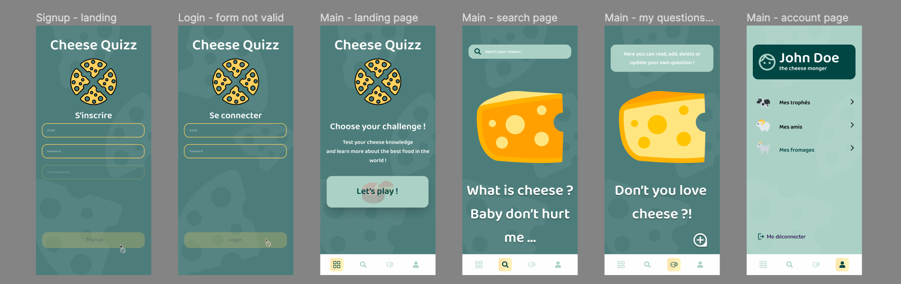

# Concept 📝

CheeseQuizz is a trivial pursuit-like game based on the best food ever : **Cheese 🧀**.

With this app you can extend your knowledge about cheese with the Quizz game.\
You can also search any kind of cheese you want to know more about and learn specific informations about them.

Finally, you can create your own questions and play for ever !

### Project Initialization

- In **VSCode**, install plugins [Prettier - Code formatter](https://github.com/prettier/prettier-vscode) and [ESLint](https://github.com/Microsoft/vscode-eslint) and configure them.
- Clone this repo, enter it.
- Run command `npm install` 🚨 **from root directory** 🚨.
- Create environment files (`.env`) in both `backend` and `frontend`: you can copy `.env.sample` files as starters.
- Run command `npm run dev` 🚨 **from root directory** 🚨.

### Tools used for this project 🛠️

- [Vite](https://www.npmjs.com/package/vite)
- [Express](https://www.npmjs.com/package/express)
- [Nodemon](https://www.npmjs.com/package/nodemon)
- [Dotenv](https://www.npmjs.com/package/dotenv)
- [React-router-dom](https://www.npmjs.com/package/react-router-dom)
- [MySQL2](https://www.npmjs.com/package/mysql2) OR [Mongoose](https://www.npmjs.com/package/mongoose)
- [Sass](https://www.npmjs.com/package/sass)
- [Concurrently](https://www.npmjs.com/package/concurrently)
- [Husky](https://www.npmjs.com/package/husky) 🐶
- [Eslint](https://www.npmjs.com/package/eslint)

# Ressources

* [GoogleDrive](https://drive.google.com/drive/folders/1waN9r-dVCi7zIUSzNJq4dtrcjzgf2JAu?usp=sharing)

* [Trello](https://trello.com/invite/b/73hFJMZu/ATTI6a5c5907e4f4a710d53e9e4527bcb5ac1FDE55E3/cheesequizz)

* [Figma](https://www.figma.com/file/dSluyiXURPMhTP0XMuaGd9/Quiz-App-(Community)?type=design&node-id=324%3A1076&mode=design&t=S93qeTC6jmIDLMcf-1)

